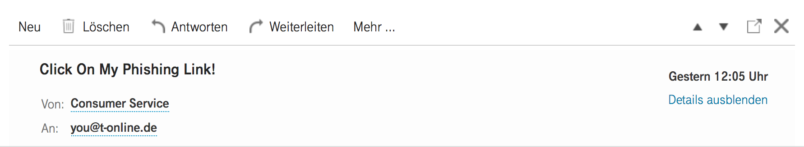
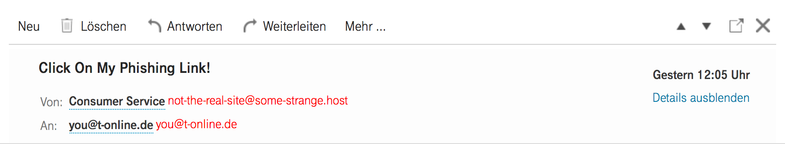

# Always Display Expanded Email Addresses

This a small user script that ensures
that Email Addresses are always displayed.

Like this:

| Before                       | After                      |
|------------------------------|----------------------------|
|  |  |

## Installation

- Install [Tampermonkey](https://tampermonkey.net/) or another user script manager
- Click [here](https://github.com/Paulomart/t-online_always_expand_addressess/raw/master/t-online_always-expand_addresses.user.js)
- Inside the popup window click install
